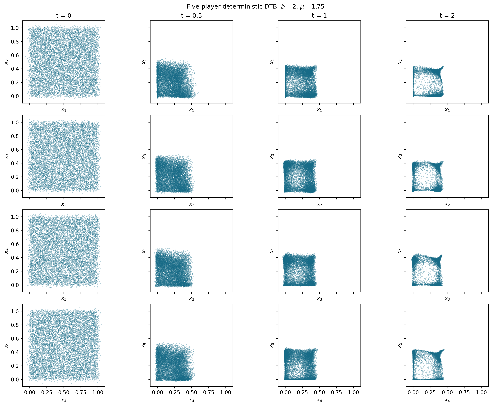
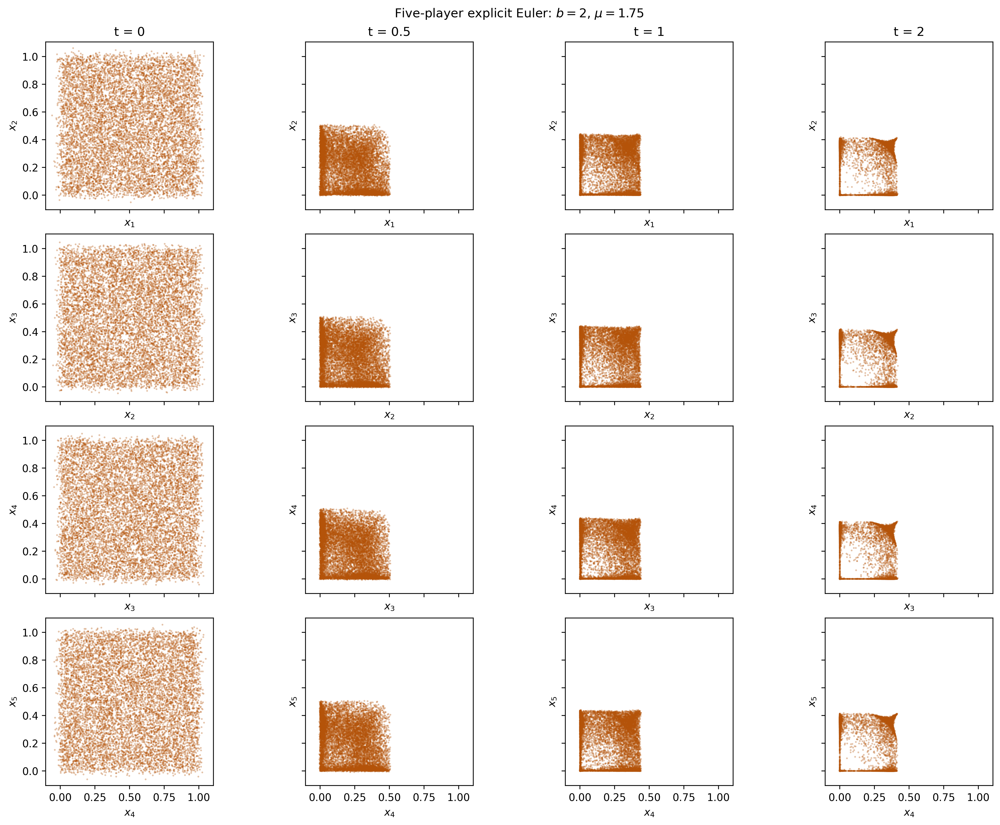
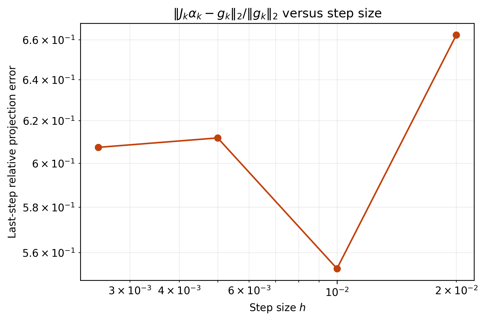
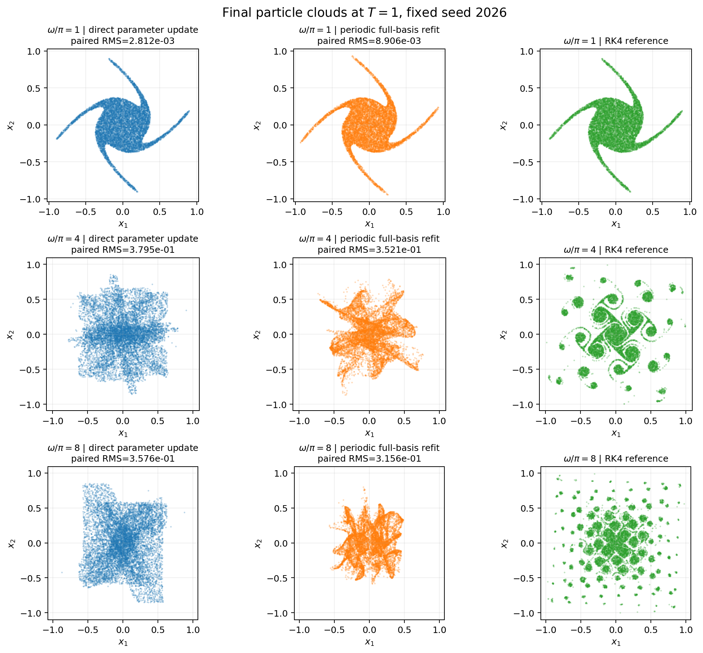
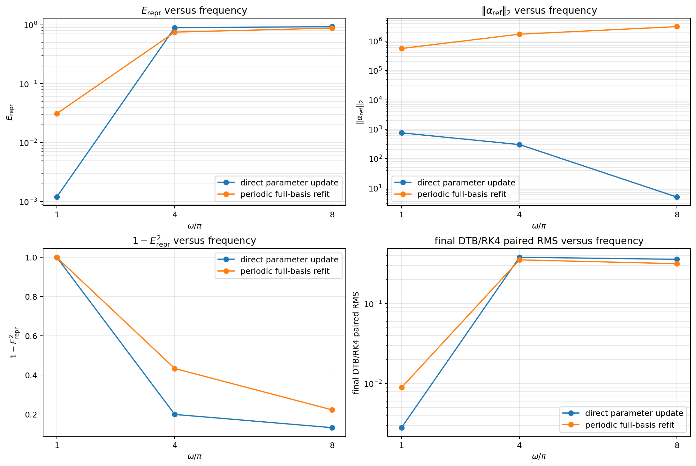
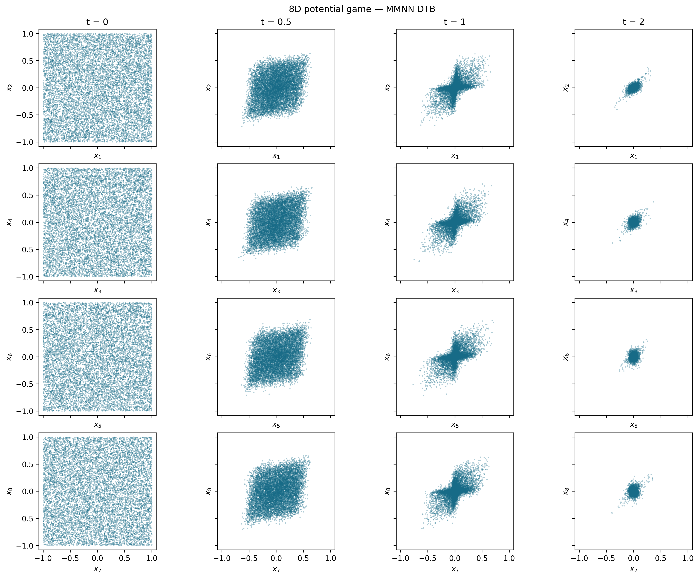
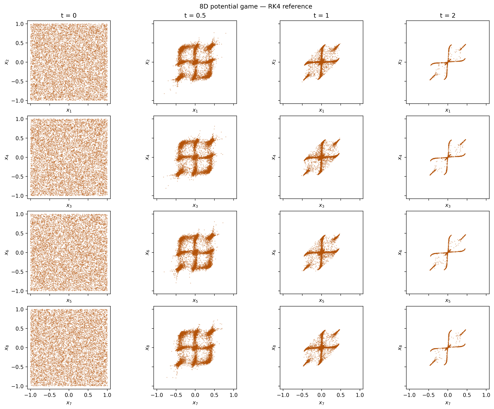

# Deep Tangent Bundle Method for Game Dynamics

**Neural tangent-space approximation of game dynamics.**

Deep Tangent Bundle (DTB) projects a target velocity field onto tangent directions generated by a neural map, then advances a particle representation of the evolving distribution. This repository studies projection accuracy, neural-basis adaptation, and time integration in potential and non-potential games.

[Notebooks](notebooks/README.md) · [Experiments](docs/experiments.md) · [Numerical methods](docs/numerics.md) · [MIT license](LICENSE)

## Getting started

Use Python 3.10 or later. From the repository root:

```bash
python -m venv .venv
source .venv/bin/activate
python -m pip install -e ".[notebooks]"
jupyter lab
```

The three main studies are independent notebooks. Each contains its experiment controls, numerical calculations, diagnostic plots, and result exports. Run its cells in order.

| Study | Notebook |
| --- | --- |
| Five-player Cournot dynamics | [Cournot analysis](notebooks/cournot_5d_analysis.ipynb) |
| Oscillatory dynamics across frequencies: direct parameter updates versus periodic refitting | [Oscillatory frequency comparison](notebooks/oscillatory_direct_vs_periodic_refit.ipynb) |
| Eight-dimensional potential game with contraction | [Eight-dimensional potential dynamics](notebooks/potential_game_8d_mmnn_dtb.ipynb) |

Additional studies are listed in the [notebook index](notebooks/README.md). Generated plots and numerical arrays are saved under `results/`.

## Repository layout

```text
.
├── README.md                 Project overview and three main studies
├── LICENSE                   MIT license
├── CITATION.cff              Citation metadata
├── CONTRIBUTING.md           Contribution guidance
├── pyproject.toml            Package metadata and dependencies
├── src/dtb_game/             Dynamics, models, projection, and integration
├── notebooks/
│   ├── README.md             Notebook catalogue
│   ├── cournot_5d_analysis.ipynb
│   ├── oscillatory_direct_vs_periodic_refit.ipynb
│   ├── potential_game_8d_mmnn_dtb.ipynb
│   └── supplementary/       Additional numerical studies
├── docs/                     Experiments and numerical methods
│   └── images/              Original report plots used in these pages
└── results/                  Generated outputs, excluded from Git
```

## Method

For particles $X_k\in\mathbb{R}^{N\times d}$, a neural map $T_\theta$, and selected parameter coordinates $S_k$, the target dynamics are

$$
\frac{dX}{dt}=v(X,\rho).
$$

The sampled tangent projection is computed using truncated SVD:

$$
J_k=D_{\theta_{S_k}}T_{\theta_k}(B_k),
\qquad
\alpha_k\approx\operatorname*{arg\,min}_{\alpha}\|J_k\alpha-v_k\|_2^2.
$$

The accumulated particle update is

$$
X_{k+1}=X_k+hJ_k\alpha_k.
$$

The tangent inputs $B_k$ are either current particles or fixed initial labels, according to the experiment. The Jacobian and target are normalized by $\sqrt{N}$, and a singular value is retained when $\sigma_j>\mathrm{rtol}\,\sigma_1$.

The two adaptation methods in the oscillatory comparison use the same accumulated particle update:

| Strategy | Particle evolution | Neural-basis adaptation |
| --- | --- | --- |
| Accumulated DTB with parameter updates | $X_{k+1}=X_k+hJ_k\alpha_k$ | Euler update of selected neural parameters |
| Accumulated DTB with periodic refitting | $X_{k+1}=X_k+hJ_k\alpha_k$ | Supervised fitting of the neural map to accumulated particles at scheduled times |

For stochastic dynamics, the package also supports probability-flow velocities, score transport, and Euler–Maruyama reference trajectories. Diffusion amplitude and covariance are recorded separately.

## Numerical experiments

The plots below are the original images extracted from the research report. Their captions identify the report settings; they are historical results rather than outputs from a fresh notebook execution.

### Five-player Cournot dynamics

For five players, the drift is

$$
b_i(x)=2b\left(\max\{\mu s_i(1-s_i),0\}-x_i\right),
\qquad s_i=\sum_{j\ne i}x_j,\quad b=2,\quad\mu=7/4.
$$

The notebook supports deterministic DTB versus explicit Euler and stochastic probability-flow DTB versus Euler–Maruyama. Its default is stochastic, with Brownian noise amplitude 0.1, 5,000 particles, $h=0.005$, and $T=2$. A tanh residual MLP of width 16 and depth 2 uses 64 parameter coordinates resampled at each step. The SVD cutoff is $10^{-6}$; computations use float64.

Snapshots at $t=0,0.5,1,2$ show adjacent coordinate projections. The notebook also provides coefficient norms, tangent-projection residuals, and stochastic score diagnostics.

| Neural-DTB | Explicit Euler reference |
| :---: | :---: |
|  |  |

*Report Figures 4-5. Columns show t = 0, 0.5, 1, 2; rows show adjacent coordinate pairs from (x1, x2) through (x4, x5). The plotted report run is deterministic, with 10,000 particles and h = 0.001.*

<details>
<summary>Step-size diagnostics from the report</summary>



*Report Figure 3. Last-step relative tangent-projection error for h = 0.02, 0.01, 0.005, and 0.0025.*

</details>

### Oscillatory dynamics: direct updates versus periodic refitting

The two-player field is

$$
b_\omega(x_1,x_2)=
\begin{pmatrix}
-\kappa x_1+A\sin(\omega x_2)\\
-\kappa x_2-A\sin(\omega x_1)
\end{pmatrix},
\qquad \kappa=A=1.
$$

The frequency sweep uses $\omega/\pi\in\{1,4,8\}$ and compares direct parameter Euler updates with periodic supervised refitting. Both methods advance accumulated physical particles. The experiment holds the initial particles, MMNN initialization, and remaining controls fixed across frequencies.

The notebook uses 10,000 training particles and 10,000 independent validation labels, seed 2026, $h=0.005$, $T=1$, and a refined RK4 reference with maximum step $0.000125$. The identity-initialized tanh residual MMNN has width/rank/depth $12/12/3$. Its requested tangent size is capped at the **338 trainable coordinates** available in this architecture; random features remain frozen. The SVD cutoff is $10^{-5}$.

Periodic refitting occurs every $0.1T$, using Adam with learning rate $10^{-3}$, at most 100 optimizer steps, and relative/absolute tolerances of $0.05$ and $10^{-7}$. Final tangent-basis representation error is evaluated by fitting fresh coefficients on the common independent RK4 validation cloud. Final particle plots compare both methods with RK4 at every frequency.



*Report Figure 7. Rows show omega/pi = 1, 4, 8; columns show direct parameter updates, periodic full-basis refitting, and RK4. Final time T = 1, seed 2026. The report run uses h = 0.001 and SVD cutoff 1e-8; panel labels retain its paired RMS values.*

<details>
<summary>Frequency-sweep diagnostics from the report</summary>



*Report Figure 6. Representation error, coefficient norm, captured-energy fraction, and final paired RMS against RK4 for the two adaptation methods.*

</details>

### Eight-dimensional potential game with contraction

This study examines the evolution and contraction of a particle cloud under an eight-player potential game:

$$
b_i(x)=-\lambda x_i-\gamma\sum_{j\ne i}(x_i-x_j)-\epsilon\sin(\omega x_i),
\qquad \lambda=0.5,\quad\gamma=0.2,\quad\epsilon=0.5,\quad\omega=4\pi.
$$

The notebook uses 10,000 uniform initial labels on $[-1,1]^8$, $h=0.001$, $T=2$, and a tanh residual MMNN of width/rank/depth $24/12/4$. It uses the full trainable tangent basis, float64 arithmetic, and an SVD cutoff of $10^{-3}$. Refined RK4 supplies the reference.

Four coordinate pairs show all eight coordinates at $t=0,0.5,1,2$. Diagnostics include trajectory RMS, mean potential, retained tangent rank, and the fraction of particles outside the initial box. The notebook saves the accumulated-map history and verifies its replay on selected initial labels.

| MMNN-DTB | RK4 reference |
| :---: | :---: |
|  |  |

*Report Figures 9-10. Columns show t = 0, 0.5, 1, 2; rows show (x1, x2), (x3, x4), (x5, x6), and (x7, x8). Both methods start from the same 10,000-particle ensemble. The report uses h = 0.001 and a refined RK4 reference.*

See [experiment controls and outputs](docs/experiments.md) and [numerical methods](docs/numerics.md) for details.

## Numerical package

| Location | Responsibility |
| --- | --- |
| `src/dtb_game/dynamics.py` | Game velocity fields and diffusion definitions |
| `src/dtb_game/models.py` | MLP and MMNN neural maps |
| `src/dtb_game/projection.py` | Tangent Jacobians, truncated SVD, and projection diagnostics |
| `src/dtb_game/integrators.py` | Particle, score, Euler/EM, and RK4 time stepping |
| `src/dtb_game/experiment.py` | Initialization, experiment execution, and numerical output |
| `src/dtb_game/refit.py` | Periodic supervised neural-map refitting |
| `src/dtb_game/representation.py` | Independent-cloud tangent representation comparisons |
| `src/dtb_game/diagnostics.py` | Approximation and dynamical diagnostics |
| `src/dtb_game/plotting.py` | Figures from numerical arrays |
| `src/dtb_game/utils.py` | Sampling, time grids, distances, and serialization |

## Diagnostics and reproducibility

Retain raw particle arrays, settings, and diagnostics alongside figures. Final neural parameters alone do not encode an accumulated particle trajectory. Backend and precision differences can affect SVD truncation and must be recorded when comparing runs.

Notebook outputs included with a study are historical results. Reduced execution checks verify that code paths run; they do not reproduce full-size experiments or establish convergence. Full experiments should be rerun with their recorded controls before making numerical comparisons.

## Citation and license

Citation metadata is provided in [CITATION.cff](CITATION.cff). The software is distributed under the [MIT license](LICENSE).
